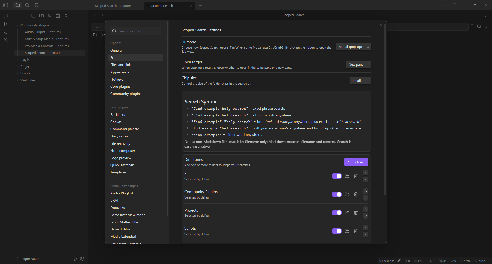
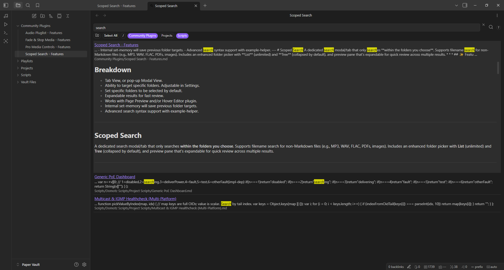
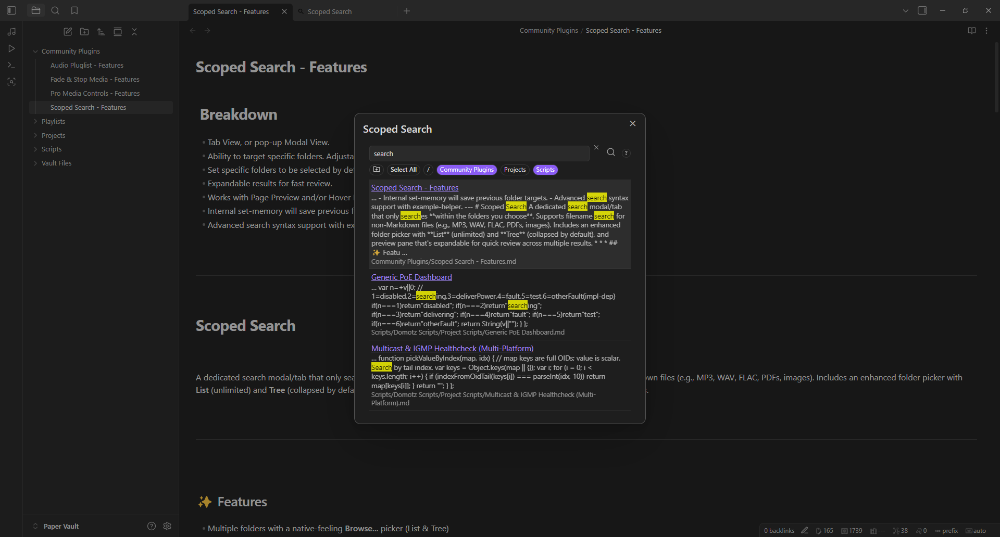

# Scoped Search

A dedicated search modal/tab that only searches **within the folders you choose**. Supports filename search for non-Markdown files (e.g., MP3, WAV, FLAC, PDFs, images). Includes an enhanced folder picker with **List** (unlimited) and **Tree** (collapsed by default), and preview pane that's expanable for quick review across multiple results.

* * *

## ✨ Features
- Multiple folders with a native-feeling **Browse...** picker (List & Tree)
- Modal or Tab UI (dock it while you work)
- **Select All** chip and per-folder **Selected by default**
- **Preview-Pane** on result click for expanded review.
- Filename search for non-Markdown files (configurable extensions)
- Session restore (remembers active chips per mode)
- Alt-click = Solo a folder (exclusive folder selection)
- Keyboard nav: Up/Down to select, **Enter** to open, **Esc** closes modal
- Open target: same pane or new pane
- Result context menu: Open, Open in new pane, Copy path
- Chip size control: Small, Medium, Large
- Advanced Search Syntax helper: tooltip "?" and Settings card with examples
- Unordered groups with "+" or "&" inside quotes: "missing+folder"
- Exact phrase with quotes: "cisco switch"
- Reorder directories with stacked up/down buttons
- Ctrl+hover for page **"preview"** or **"Hover Editor"** (supported)

> **Version:** 2.0.7 · **Obsidian:** 1.5.0+ · **Platforms:** Desktop, MAC, iOS, and Android  

* * *

## 📸 PREVIEW | Easily add target folders and toggle which ones are selected by default when search is opened
| Settings |
| --- |
|  |

* * *

## 📸 PREVIEW | Open as Tab, or optional Pop-Up modal for a cleaner look - Select single, multiple or all target folders during search
| Tab View | Modal View |  
| --- | --- |  
|  |  |  

* * *

## 📸 PREVIEW | Scrollable Preview-Pane for expanded review of results
| Preview-Pane Closed | Preview-Pane Open (on click) |
| --- | --- |
|  |  |

* * *

## 📸 PREVIEW | Works with Page Preview and/or Hover Editor
| Page Preview Support | Hover Editor Support |
| --- | --- |
|  |  |

* * *

## 📦 Install Methods: 
- Release ZIP
1. Download `scoped-search-2.0.3-release.zip` from **Releases**.
2. Unzip to `.obsidian/plugins/scoped-search/` (or create new folder in `.obsidian/plugins` named **"scoped-search"**) so it contains the unzipped `manifest.json`, `main.js`, `styles.css`.
3. Reload Obsidian and enable **"Scoped Search"**.

- BRAT
1. Select **"Add beta plugin"**.
2. Enter **"https://github.com/ragetrip/scoped-search"**.
3. Expand the **"Select a version"** drop down, and select **"Latest version"**.
4. Select "**Add plugin"**, then enable **"Scoped Search"**.

- Community Plugins (once available)
1. Search **"Scoped Search"**.
2. Select **"Install"**.
3. Select **"Enable"**.

* * *

## 🚀 Usage
- Set up folders in **Settings -> Scoped Search** or from UI via the **"Folder"** icon.
- Use the ribbon icon or the **Open Scoped Search** command.
- Toggle chips to include/exclude - **Alt-click** a chip to solo it.
- Hover the "?" next to the search bar for quick advanced Search Syntax help.
- Right-click a result for more actions.
- Ctrl-click  the ribbon icon while in Modal mode to also open Tab View.
- Click result header to open (via your selected menu method) or click body of result to expand it.

* * *

## ⚙️ Settings
- **UI mode:** Modal (pop-up) or Tab (docked view)
- **Open target:** Open in same pane or new pane
- **Chip size:** Small, Medium, Large
- **Advanced Search Syntax:** At-a-glance examples in Settings and from the "?" tooltip
- **Directories:** Add/replace/remove - toggle *Selected by default* - reorder with up/down buttons
- **File Types:** Include non-Markdown filenames - set allowed extensions

* * *

## ☕ Support
If this plugin helps you, consider supporting: https://buymeacoffee.com/ragetrip

See more of my work: [GitHub @ragetrip](https://github.com/ragetrip?tab=repositories).
